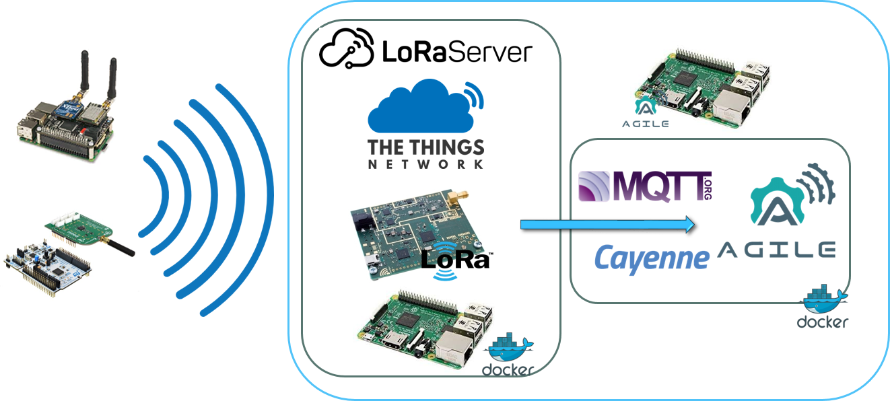

<!--
# Copyright (C) 2018 ATOS Spain S.A., Sky-Watch
# All rights reserved. This program and the accompanying materials
# are made available under the terms of the Eclipse Public License 2.0
# which accompanies this distribution, and is available at
# https://www.eclipse.org/legal/epl-2.0/
# 
# SPDX-License-Identifier: EPL-2.0
#
# Contributors:
#     ATOS Spain - agile-lora protocol implementation
#	  SKy-Watch - LoRaServer Dockerization and integration
-->

# Agile LoRa(WAN) protocol implementation

> LoRaWAN protocol implementation for the AGILE gateway, based on MQTT and Cayenne

This repository handles the communication between LoRaWAN nodes (Class A) and the legacy [AGILE stack](https://github.com/Agile-IoT/agile-stack), as shown in the figure below. 


|  | 
|:--:|
| *LoRa protocol overview* |


As illustrated in the middle of the picture, this repository supports the installation of two different LoRaWAN stacks, namely [**The Things Network (TTN)**](https://www.thethingsnetwork.org/) and [**LoRaServer**](https://www.loraserver.io/) on a Raspberry Pi (2 or 3). In a nutshell, nodes use the LoRaWAN protocol and send data to an Application Server, which will be the connection point to our implementation. Technically speaking, we subscribe to an Application Server's MQTT broker in order to get all the data streams coming from the various sensors. After that, the *agile-lora* protocol (right part of the figure) is the responsible for the communication with the [*agile-core*](https://github.com/Agile-IoT/agile-core).


This protocol exposes the [org.eclipse.agail.Protocol](http://agile-iot.github.io/agile-api-spec/docs/html/api.html#iot_agile_Protocol) interface:

- DBus interface name: *org.eclipse.agail.protocol.LoRa*
- DBus interface path: */org/eclipse/agail/protocol/LoRa*


## Versions

As not all users might own a fully-fledged LoRaWAN gateway and have only a set of nodes that are e.g. connected to a TTN/LoRaServer Application Server's MQTT integration, *this repository* embraces all the necessary to communicate with the legacy AGILE stack.

However, we also offer another version that includes an auto-configurable Docker image that deploys the full LoRaServer stack within the Raspberry Pi (integration of the Docker images under development)

## Installation


### Requirements:
- Software:
  * [docker + docker-compose](https://docs.docker.com/compose/install/)
  * [Node.js + npm](https://nodejs.org/en/)
  * [resin CLI](https://www.npmjs.com/package/resin-cli)
  * [etcher](https://etcher.io/)
- Hardware:
  * Raspberry pi 2 or 3
  * SD card `>= 8gb`
  * Wifi dongle or ethernet cable *(optional if you have the pi3)*

### Configuration

Basically, we need to specify the following variables, which define the connection to the TTN/LoRaServer MQTT Broker

```
LORAWAN_APP_SERVER = "LoRaServer"  # Current options handled ("TTN", "LoRaServer")
LORAWAN_APPID  = "<YOUR APP ID>"
LORAWAN_PSW    = "<YOUR APP password>"
LORAWAN_URL = "< URL to the MQTT Broker>"
```
As we have hinted before, two options are available, with slight differences between each other. For a deeper understanding, please refer to [TTN](https://www.thethingsnetwork.org/docs/applications/mqtt/) and [LoRaServer](https://www.loraserver.io/install/mqtt-auth/) MQTT documentation. 


### Launching the protocol


   #### 1. Docker-compose (agile compose)
   
   In this very first example, we only have to: 1- set the environment variables within the `docker-compose.yml` file (sample below, building from the source code, since the Docker image is not ready yet)
   
   ```
version: '3'
services:
  agile-lora:
    container_name: agile-lora
    # image: agileiot/agile-lora
    build: .
    depends_on:
      - agile-dbus
      - agile-core
    volumes:
      - $DBUS_SESSION_SOCKET_DIR:/usr/src/app/.agile_bus
    environment:
      - DBUS_SESSION_BUS_ADDRESS=unix:path=/usr/src/app/.agile_bus/agile_bus_socket   
      - LORAWAN_APP_SERVER = "LoRaServer"  # Current options handled ("TTN", "LoRaServer")
      - LORAWAN_APPID  = "<YOUR APP ID>"
      - LORAWAN_PSW    = "<YOUR APP password>"
      - LORAWAN_URL = "< URL to the MQTT Broker>"   
    restart: always
    privileged: true
    network_mode: "host"
   ```
   
   Behold that this module depends on both [*agile-dbus*](https://github.com/Agile-IoT/agile-dbus) and [*agile-core*](https://github.com/Agile-IoT/agile-core).
   The next and last step to make it run is the following command:
   
   ```
   docker-compose up
   ```


   #### 2. Direct execution of the Python script(s)

We also offer the possibility of directly execute the scripts. In this case, we assume that all the **agile-stack** is properly running on the Pi and the DBus Session Server is already up-and-running (otherwise, DBUS connection errors may arise during the execution of the process).

Before running the server and the subsequent protocol instance, some libraries must be installed: 

```
sudo apt-get install libdbus-1-dev libdbus-glib-1-dev python3-gi
```

Moreover, some other libraries have to be installed too; in this case, through an explicit requirements file

```
sudo python3 -m pip install -r requirements.txt
```

For this first and unplugged version (not connected to the AGILE stack yet), we can run the server and check that the bus and its underlying methods work accordingly. 
*NOTE: Make sure that the prompt is within the 'protocol' folder*.
*NOTE 2: Before running the script, we must manually specify the environment variables defined above*.

```
sudo DBUS_SESSION_BUS_ADDRESS=unix:path=$HOME/.agile/agile_bus/agile_bus_socket ./dbus_server.py
```

### Devices 

Due to the current version of AGILE's DeviceFactory (which can be found within [agile-core](https://github.com/Agile-IoT/agile-core)), the creation of devices is static and does not pay attention to the different components that actual devices might have. This means that we have had to set some components that those devices own. Namely, we have followed Sky-watch's devices that are used for one of the pilots (you can find more information about the project's pilots [here](http://agile-iot.eu/category/pilots/)).

As a matter of fact, the components (sensors) that are instanced when a node is registered are the following ones: 

- Temperature
- Relative Humidity
- Altitude
- Latitude
- Longitude
- SNR
- RSSI

### Integration with **agile-stack**

At the time of writing this README file, the agile-lora protocol is not part of the agile-stack ecosystem. As soon as we achieve to merge them, we will properly update the documentation.


## License

[Eclipse Public License -v 2.0](https://www.eclipse.org/legal/epl-2.0/)